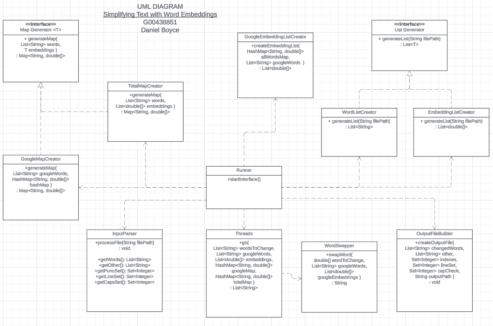

# SDDS-Assignment 
*Daniel Boyce G-00438851*

## Description
This project is a CLI program that analyzes and modifies text input by replacing less common words with more widely used and easier to understand alternatives. 

## How to use
In order to use this program, after the files have been compiled and the Runner file is executed, you will see a user interface in the console. In order for this program to work properly make sure you set the first 4 parameters before running the program.
1. Set the path to the embeddings file you have.  
2. Set the path to the google 1000 most common words list you have.  
3. Set the path to the text file you want changed.  
4. Set the path to where you want the results to be sent.  
If all parameters are set correctly you can run the program with 5.
You should get a success message, close the program with 0 and look for your output file where you specified.

## UML visualisation

## Build Notes
The idea for this project. Similar to the last project in that it is a CLI program that takes an input and makes a modification, saves the output to a designated location.

Where to begin?

-Copy the User interface from my last project. ✔  
-Remove parts that aren't appropriate. ✔

What does this app actually need to do???   
It needs to point to a txt file.  
It needs to go through every word in text file and replace them with the closest word in the Google 1000 list

Next steps
Isolate problems
Create a class that processes an embeddings file
This file will need to be able to process the embedding file and google 1000 file.
**Is there an opportunity for reuse here?**
- Have a component that splits up the words in a txt file and returns an array?
- This could be used in the Extractor for the embeddings file, the google 1000, and also the txt file to be modified. 

**Remember to make everything lowercase**
Create a Set that holds the google 1000. ✔
Create a Map that holds the embeddings for the google 1000 words.
Do i need to create the set if I'm just going to create the map afterwards?

## QUESTIONS?
Should the input be raw user input or a path to a txt file? YES
Should the user be allowed to set the filepath for the Embeddings file and or the Google file or will that be hardcoded and only allow user to assign output location and input text location?
If a word in the text file is not found in the embeddings list, should it just return what is in the text file? How is this error handled?

# Go through entire app sequentially, what are the steps necessary?

Runner will start user interface.  
1 - Allow user to set the filepath for Input text file  
2 - Allow user to set the filepath for Output result location  
3 - Run program and make modification   
4 - Allow user to toggle between similarity algorithm A, B, C(Possibility)  
5 - Allow user to edit the filepath of the embeddings file (Possibility)  
6 - Allow user to edit the filepath of the common words file (Possibility)  
0 - Exit  

WHAT SET UP IS REQUIRED??  

Input text file provided.  
Output file destination provided.  

Create a wordEmbeddings Array (Just words)  
Create an embeddings Array (Just embeddings)  
Create a googleWords Array (Just words)  
Create a googleEmbeddings (Just embeddings)  
CAN I AVOID THE ABOVE IN ORDER TO MAKE THE APP MORE EFFICIENT?  

Create a Map that holds all embedding words and embeddings.  

Create a Map that holds all 1000 common words and their embedding.  

**Can all steps above be done on interface start up?**

When the run button is clicked, the program will need to do the following :  

Parse through the input file provided and push each individual word into an array. (Account for any additional chars like . , and lowercase everything)  

(CONSIDERATION : How do I return things like . , and uppercase afterward?)  

Iterate through array (through each word in given input). Create a second array that contains each word's embedding {THIS IS INEFFICIENT. Instead check if word exists in googleWordMap if so take the embedding value otherwise use arrays}  

Now iterate through googleWordArray again. If word !exist in googleWordMap perform similarity algorithm on googleEmbeddingArray and choose most similar word to replace it. Each iteration should add a word to the result array  

**WHAT DOES THE SIMILARITY ALGORITHM CONSIST OF?** 
Very similar to the last project, regarding the word that needs to be swapped. Take that words embedding, and compare it against all the embeddings in the googleEmbeddingsArray. Take the top pick and use the googleEmbeddingsArray index to find the associated word via googleWordArray

For now just print result array to output destination and worry about formatting when we get to this point.  

## Next
Input parser takes a sample txt file, converts all words to Uppercase and returns all again including commas full stops and other things that find their way into sentences. All I have to do is remove the uppercasing logic and put in the swap logic.

See is it possible to remove GoogleMapCreator & TotalMapCreator for just one class and have it work the same. The only thing to be aware of is that the generateMap function takes different parameters 

 ## Problems encountered worth mentioning

 An issue that took a while to overcome was giving me results that seemed unrelated to each other. I soon realised how I was implementing the google embeddings list was wrong. I initialised the googleEmbeddings list after I created the googleWordMap so at first I created the embeddings list with this googleHashMap.values(). Without realising that the hashMap does not return the values in the order that they were created in. This jumbled the embeddings up with random words creating nonsense and a headache.

 WHAT IS LEFT TO DO
 Now I just need to create the input parser that will extract the words into a List<String>
 And pass that List into the Threads.go()

 Input parser thoughts
 Have it parse the input file.
 Use Pattern and matcher to identify if it's a word or punctuation.
 If it's a word, place in wordList
 If it's punctuation or something else place in otherList
 Problem to solve :
    How do I stitch it all back together in the correct order?
    Using a third array?
    Third array to keep track of all the indexes of punctuation or others.
    When sticking back together, if the loop is at an index that is contained inside the third array, insert punctuation instead.

Problem to solve :
   program does not process words with capital letters.
   Add the ability to detect an uppercase word,
      lowercase it before searching for change,
      make uppercase again after change

INSTEAD OF USING HASHMAP
use another Set to take note of the index at which a capital letter occurs. This way You can capitalise inside the ofb maybe?
